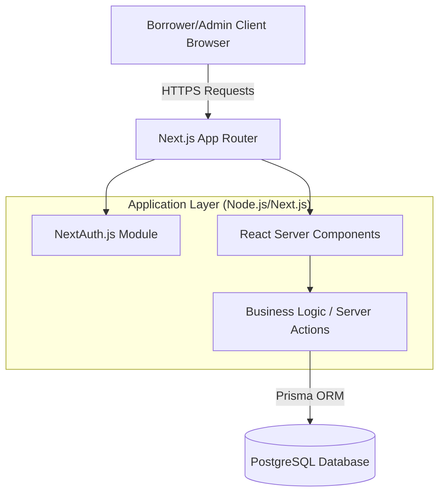
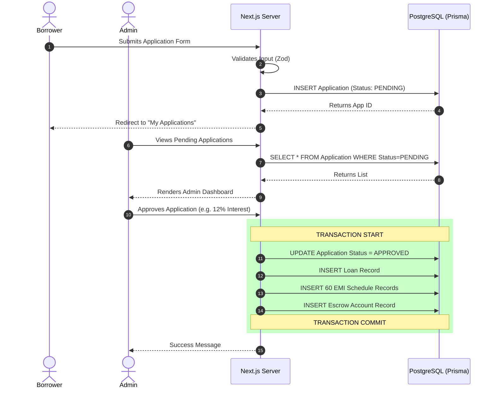

# High Level Design (HLD) - Cred91

This document outlines the High Level Design of the Cred91 system. It is intended for software architects, product managers, and senior developers to understand the core modules, the macro-level data flow, and the reasoning behind architectural decisions.

---

## 1. System Architecture Overview

Cred91 employs a modern, server-rendered monolithic architecture using Next.js. This approach eliminates the overhead of managing a separate frontend API and backend microservices, allowing for rapid iteration and secure, tightly-coupled data fetching.

### The Three Tiers
1. **Presentation Tier (Client/Browser):** Handles rendering the UI and collecting user input. React Client Components manage interactivity (like forms and mobile menus).
2. **Business Logic Tier (Next.js Server):** Handles authentication, validates incoming form data (using Zod), calculates complex mathematics (like EMI schedules), and enforces role-based access control.
3. **Data Tier (PostgreSQL):** Stores all persistent state. Chosen for its strict ACID compliance, which is non-negotiable for financial applications handling money and schedules.

---

## 2. Deep Dive into Core Modules

The application is logically divided into three primary modules.

### 2.1 Authentication & Authorization Module
Security is paramount. We use **NextAuth.js** configured with a custom Credentials Provider.
- **Passwords:** Are never stored in plain text. They are hashed using `bcryptjs` before insertion into the database.
- **Sessions:** Handled securely via HTTP-Only JSON Web Tokens (JWT). The client never has direct access to the session token via JavaScript, preventing XSS attacks.
- **Authorization:** Every user has a `Role` (`BORROWER` or `ADMIN`). Middleware and Server Actions explicitly check this role before allowing access to specific pages (like `/admin`) or executing database mutations.

### 2.2 Loan Origination System (LOS) Module
The LOS handles the "Intake" phase. 
- **Borrower Flow:** A user signs up, navigates to the "Apply for Loan" page, and submits details like requested amount, tenure, and purpose.
- **Admin Underwriting:** Admins view a queue of `PENDING` applications. The system assists the admin by suggesting interest rates based on dummy credit scores. The admin has the final say and submits a decision (`APPROVED` or `REJECTED`) along with the final interest rate.

### 2.3 Loan Management System (LMS) Module
The LMS handles the "Servicing" phase. It automatically activates the moment an admin approves an application.
- **Loan Instantiation:** A new `Loan` record is created representing the active debt.
- **Amortization Engine:** The system calculates the exact monthly payment (EMI) required to pay off the principal and interest over the requested tenure. It then generates individual database records for every single future payment.
- **Escrow Tracking:** For loans that require impound accounts (like property taxes or insurance), an `Escrow` record is created to track these funds separately from the principal balance.

---

## 3. Core Data Flow: Application to Approval

Understanding how an application transitions into an active loan is critical. Here is the exact sequence of events:

### Why use a Transaction?
In Step 7, when an admin approves a loan, the system must create the Loan, 60 EMI records, and an Escrow account. If the server crashes after creating the Loan but *before* creating the EMI records, the database would be left in an invalid state. Prisma transactions ensure that either *all* of these records are created successfully, or *none* of them are, maintaining absolute data integrity.
