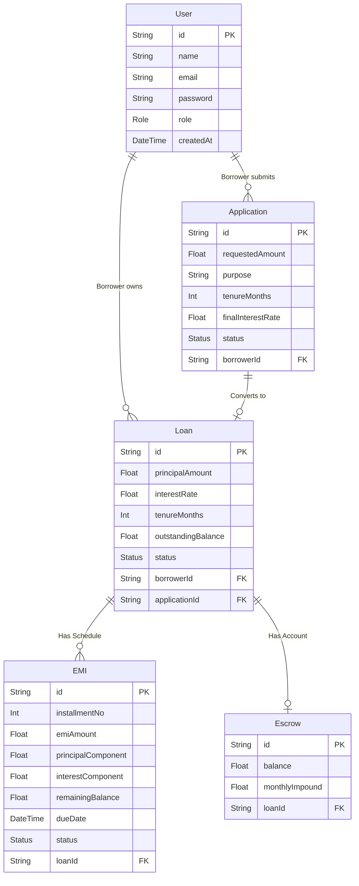

# Low Level Design (LLD) - Cred91

This document provides a granular, technical look at the implementation details of Cred91. It is meant for engineers actively developing or maintaining the codebase. It covers the exact database schema, algorithmic logic, and UI component structures.

---

## 1. Database Schema & Data Dictionary

The database is built on PostgreSQL and managed via Prisma ORM. Below is the Entity Relationship Diagram (ERD).

### Data Dictionary Highlights
- **User.role:** An ENUM enforcing strict `BORROWER` or `ADMIN` values.
- **Application.status:** Can be `PENDING`, `UNDER_REVIEW`, `APPROVED`, or `REJECTED`.
- **Loan.outstandingBalance:** Tracks the remaining principal to be paid. Starts equal to `principalAmount`.
- **EMI.status:** ENUM for `PENDING`, `PAID`, or `OVERDUE`.

---

## 2. Core Algorithm: EMI Amortization

The most complex mathematical logic in the application is generating the EMI (Equated Monthly Installment) schedule. This happens inside `app/actions/application.ts` during the `approveApplication` function.

Cred91 uses the standard **Reducing Balance Method** for calculating EMIs.

### The Mathematics
The formula to calculate the fixed monthly payment is:
`E = P * r * (1+r)^n / ((1+r)^n - 1)`

Where:
- `E` is the fixed EMI amount.
- `P` is the Principal Loan Amount.
- `r` is the Monthly Interest Rate (Annual Rate divided by 12, then divided by 100).
- `n` is the total number of months (Tenure).

### Code Implementation Flow
When a loan for ₹5,50,000 at 12% over 60 months is approved, the system doesn't just save those three numbers. It runs a loop 60 times to generate a distinct record for every single month.

Inside the loop for a given month `i`:
1. **Calculate Interest for this month:** `Interest = Current Balance * Monthly Rate`
2. **Calculate Principal paid this month:** `Principal Paid = EMI - Interest`
3. **Update Balance:** `New Balance = Current Balance - Principal Paid`
4. **Database Insertion:** Construct the Prisma `create` object for the `EMI` table with these exact values, and set the `dueDate` to `i` months from today.

This ensures that if a borrower wants to see exactly how much of their 34th payment is going towards interest versus principal, the database already has the exact mathematical answer pre-calculated.

---

## 3. Server Actions Details

Next.js Server Actions allow us to write secure server code that can be called directly from Client Components (like forms).

### `submitApplication(data)`
1. **Validation:** Receives raw FormData. Passes it through Zod's `applicationSchema` to ensure amounts are positive numbers and strings are sanitized.
2. **Authentication Check:** Reads the HTTP-Only cookie via `requireAuth()` to identify which user is making the request.
3. **Execution:** Calls `prisma.application.create()` and links it to the `userId`.

### `approveApplication(applicationId, formData)`
This is the most critical function. It wraps four distinct operations inside a `$transaction`.
1. Validates the admin's provided interest rate.
2. Updates the application status to `APPROVED`.
3. Creates the `Loan` record.
4. Executes the Amortization loop (described above) and creates all `EMI` records simultaneously.
5. Initializes an empty `Escrow` account for the loan.

---

## 4. UI Component Architecture

The frontend is built with Tailwind CSS and focuses heavily on reusability and modern aesthetics (glassmorphism).

- **`Sidebar` (`components/layout/sidebar.tsx`):** A responsive navigation component. It reads the user's role from props and dynamically renders the correct navigation links (`adminNav` vs `borrowerNav`). On desktop, it acts as a fixed glass-pane. On mobile, it acts as a hidden drawer with a hamburger menu toggle.
- **`StatCard` (`components/shared/stat-card.tsx`):** A stateless component used to display high-level metrics (e.g., Total Outstanding Balance). It accepts props for title, value, icon, and an optional `trend` object to show green/red up/down arrows.
- **Forms & Validation:** All forms use `react-hook-form` coupled with `@hookform/resolvers/zod`. This ensures that if a user types a negative number for a loan amount, the form turns red immediately in the browser without even needing to contact the server.
