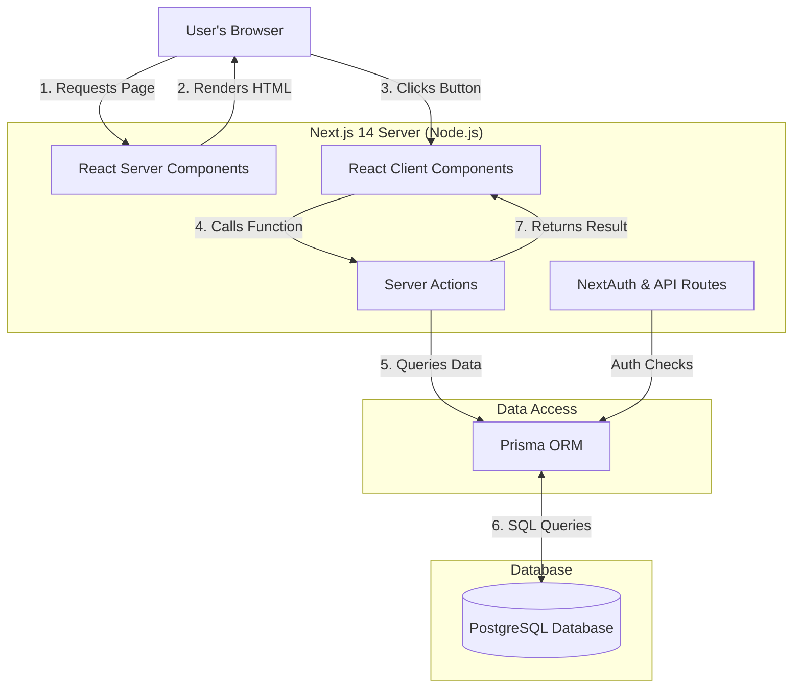

# Cred91 - Comprehensive Project Overview

Welcome to the **Cred91** project! This document serves as the foundational guide to understanding the entire application. Whether you are a new developer joining the team, a product manager, or a reviewer, this document will explain what the system does, how it works under the hood, and how the codebase is organized.

---

## 1. What is Cred91?

**Cred91** is a complete, full-stack web application designed for the financial technology (Fintech) sector. It combines two major systems into one unified platform:

1. **Loan Origination System (LOS):** This is the "front door" of the system. It handles everything that happens *before* a user gets money. It allows a user (Borrower) to sign up, fill out a loan application, and submit it. It also allows an administrator (Admin) to review the application, underwrite it (decide the interest rate), and approve or reject it.
2. **Loan Management System (LMS):** This handles everything that happens *after* a loan is approved. Once an application is approved, the LMS takes over. It mathematically generates a full repayment schedule (EMI schedule), tracks the outstanding balance, and manages Escrow accounts for things like insurance and taxes.

---

## 2. Architecture & Code Flow

Cred91 is built using a modern **Monolithic Architecture** powered by the **Next.js 14 App Router**. This means both the frontend (what the user sees) and the backend (the database interactions and business logic) live in the same codebase.

### The Request Lifecycle (How data flows)



### Explanation of the Diagram:
1. **React Server Components (RSC):** When a user requests a page (e.g., the Dashboard), the server fetches the required data securely from the database *before* sending anything to the browser. This makes the app incredibly fast and secure because sensitive database logic never reaches the user's computer.
2. **Client Components:** Parts of the UI that require interactivity (like forms, dropdowns, or buttons) are marked with `"use client"`. They run in the browser.
3. **Server Actions:** Instead of building traditional REST APIs (like `/api/submit-loan`), Next.js allows Client Components to directly call secure server functions (Server Actions). When you submit a form, it securely triggers a function on the server.
4. **Prisma ORM:** The server doesn't write raw SQL queries. Instead, it uses Prisma, a modern Object-Relational Mapper (ORM), which translates TypeScript code into secure, optimized PostgreSQL queries.

---

## 3. Detailed Folder Structure

Understanding where files live is crucial for navigating the codebase. Here is a detailed breakdown:

```text
Cred91/
├── app/                        # The core Next.js routing directory
│   ├── admin/                  # Admin Portal. All routes starting with /admin
│   │   ├── applications/       # Admin views for pending applications
│   │   ├── loans/              # Admin views for active loans
│   │   └── layout.tsx          # Wrapper layout that enforces Admin Authentication
│   ├── api/                    # Traditional HTTP endpoints
│   │   └── auth/               # NextAuth.js endpoints for handling login/sessions
│   ├── auth/                   # Publicly accessible Login and Signup pages
│   ├── dashboard/              # Borrower Portal. All routes starting with /dashboard
│   │   ├── apply/              # The multi-step loan application form
│   │   └── layout.tsx          # Wrapper layout that enforces Borrower Authentication
│   ├── globals.css             # Global Tailwind CSS, Custom Fonts, and Theme Colors
│   └── page.tsx                # The public-facing Landing Page (marketing site)
│
├── components/                 # Reusable UI building blocks
│   ├── layout/                 # Structural components like the Navigation Sidebar
│   ├── shared/                 # Common elements (StatCards, Status Badges)
│   └── ui/                     # Shadcn/ui components (Buttons, Inputs, Tables)
│
├── lib/                        # Utility functions and core configuration
│   ├── actions/                # Server Actions (Business logic for DB mutations)
│   ├── prisma.ts               # Initializes the database connection
│   └── session.ts              # Helper functions to get the current logged-in user
│
├── prisma/                     # Database Configuration
│   ├── schema.prisma           # The Single Source of Truth for Database Tables
│   └── seed.ts                 # Script to populate the DB with dummy data for testing
│
└── public/                     # Images, SVGs, and static assets
```

---

## 4. Key Technologies Used

- **Next.js (App Router):** The overarching React framework. Chosen for its superior server-side rendering and built-in routing.
- **TypeScript:** Adds static typing to JavaScript. Ensures that if we expect a number for an interest rate, we don't accidentally pass a string.
- **PostgreSQL:** A highly reliable, open-source relational database. Chosen because financial applications require strict data integrity and relational mapping (ACID compliance).
- **Prisma:** The ORM. Makes interacting with PostgreSQL safe and typed.
- **Tailwind CSS:** A utility-first CSS framework for rapid UI development.
- **NextAuth.js:** Handles complex authentication flows securely.

---

## 5. Local Setup & Installation

If you need to run this project locally, follow these steps:

1. **Install Dependencies:** Run `npm install`.
2. **Environment Setup:** Create a `.env` file in the root directory and provide your PostgreSQL connection string (`DATABASE_URL`) and a secure random string for `NEXTAUTH_SECRET`.
3. **Database Sync:** Run `npx prisma db push` to create the tables in your database.
4. **Seed Data:** Run `npx prisma db seed` to generate an Admin account and dummy borrowers.
5. **Start Development Server:** Run `npm run dev`. The app will be available at `http://localhost:3000`.
